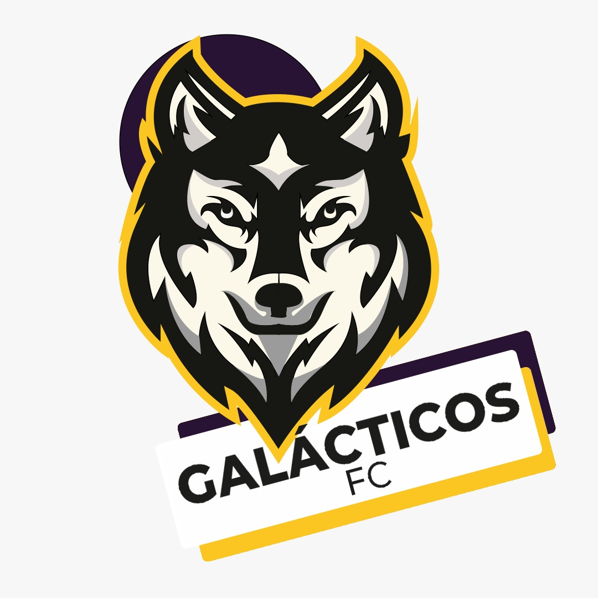

<!doctype html>
<html lang="en">

<head>
    <!-- Required meta tags -->
    <meta charset="utf-8">
    <meta name="viewport" content="width=device-width, initial-scale=1, shrink-to-fit=no">

    <link rel="shortcut icon" href="assets/images/favicon.ico">
    <link rel="icon" type="image/gif" href="assets/images/animated_favicon1.gif">

    <link rel="stylesheet" href="assets/css/bootstrap.min.css">

    <link rel="stylesheet" href="assets/css/owl.carousel.min.css">

    <link rel="stylesheet" href="assets/css/owl.theme.default.min.css">

    <link href="https://fonts.googleapis.com/css2?family=Ubuntu:wght@700&display=swap" rel="stylesheet">

    <link rel="stylesheet" href="assets/css/fontawesome.css">

    <link rel="stylesheet" href="assets/css/style.css">
    <!-- <link rel="stylesheet" href="assets/css/players.css"> -->
    <link rel="stylesheet" href="assets/css/preload.css">
    <link rel="stylesheet" href="assets/css/games.css">

    <title>galácticos</title>
</head>

<body>

    

        

        

        

            <i class="fas fa-futbol balon-icon animatedColor"></i>
            

        

    

    <!-- <header> -->
    <nav class="nav navbar navbar-expand-lg navbar-dark bg-dark">
        

            <a class="navbar-brand" href="#">
                 GALÁCTICOS
            </a>
        

        

            

                

                    SIGUENOS
                    <a href="#"><i class="fab fa-facebook-f"></i></a>
                    <a href="#"><i class="fab fa-instagram"></i></a>
                    <a href="#"><i class="fab fa-youtube"></i></a>
                    <a href="#"><i class="fab fa-twitter"></i></a>
                

                

                    <a href="">VER FUTBOL EN LINEA</a>
                

            

            

                <button class="navbar-toggler" type="button" data-toggle="collapse" data-target="#navbarNavAltMarkup" aria-controls="navbarNavAltMarkup" aria-expanded="false" aria-label="Toggle navigation">
                        
                      </button>
                

                    

                        <a class="nav-link" href="./index.html">INICIO</a>
                        <a class="nav-link active" href="./players.html">JUGADORES</a>
                        <a class="nav-link" href="#">PARTIDOS</a>
                        <a class="nav-link" href="./contact.html">CONTACTO</a>
                    

                

            

        

    </nav>
    <!-- </header> -->

    <section id="result-games">
        <ul class="nav nav-pills mb-3" id="pills-tab" role="tablist">
            <!-- 
 -->
            <li class="nav-item mt-2" role="presentation">
                <a class="nav-link active" id="enero-tab" data-toggle="pill" href="#enero" role="tab" aria-controls="enero" aria-selected="true">
                    <small>2020</small>
                     
                    ENERO
                </a>
            </li>
            <li class="nav-item mt-2" role="presentation">
                <a class="nav-link" id="febrero-tab" data-toggle="pill" href="#febrero" role="tab" aria-controls="febrero" aria-selected="false">
                    <small>2020</small>
                     
                    FEBRERO
                </a>
            </li>
            <li class="nav-item mt-2" role="presentation">
                <a class="nav-link" id="marzo-tab" data-toggle="pill" href="#marzo" role="tab" aria-controls="marzo" aria-selected="false">
                    <small>2020</small>
                     
                    MARZO
                </a>
            </li>
            <li class="nav-item mt-2" role="presentation">
                <a class="nav-link" id="abril-tab" data-toggle="pill" href="#abril" role="tab" aria-controls="abril" aria-selected="false">
                    <small>2020</small>
                     
                    ABRIL
                </a>
            </li>
            <li class="nav-item mt-2" role="presentation">
                <a class="nav-link" id="mayo-tab" data-toggle="pill" href="#mayo" role="tab" aria-controls="mayo" aria-selected="false">
                    <small>2020</small>
                     
                    MAYO
                </a>
            </li>
            <li class="nav-item mt-2" role="presentation">
                <a class="nav-link" id="junio-tab" data-toggle="pill" href="#junio" role="tab" aria-controls="junio" aria-selected="false">
                    <small>2020</small>
                     
                    JUNIO
                </a>
            </li>
            <li class="nav-item mt-2" role="presentation">
                <a class="nav-link" id="julio-tab" data-toggle="pill" href="#julio" role="tab" aria-controls="julio" aria-selected="false">
                    <small>2020</small>
                     
                    JULIO
                </a>
            </li>
            <li class="nav-item mt-2" role="presentation">
                <a class="nav-link" id="agosto-tab" data-toggle="pill" href="#agosto" role="tab" aria-controls="agosto" aria-selected="false">
                    <small>2020</small>
                     
                    AGOSTO
                </a>
            </li>
            <li class="nav-item mt-2" role="presentation">
                <a class="nav-link" id="septiembre-tab" data-toggle="pill" href="#septiembre" role="tab" aria-controls="septiembre" aria-selected="false">
                    <small>2020</small>
                     
                    SEPTIEMBRE
                </a>
            </li>
            <li class="nav-item mt-2" role="presentation">
                <a class="nav-link" id="octubre-tab" data-toggle="pill" href="#octubre" role="tab" aria-controls="octubre" aria-selected="false">
                    <small>2020</small>
                     
                    OCTUBRE
                </a>
            </li>
            <li class="nav-item mt-2" role="presentation">
                <a class="nav-link" id="noviembre-tab" data-toggle="pill" href="#noviembre" role="tab" aria-controls="noviembre" aria-selected="false">
                    <small>2020</small>
                     
                    NOVIEMBRE
                </a>
            </li>
            <li class="nav-item mt-2" role="presentation">
                <a class="nav-link" id="diciembre-tab" data-toggle="pill" href="#diciembre" role="tab" aria-controls="diciembre" aria-selected="false">
                    <small>2020</small>
                     
                    DICIEMBRE
                </a>
            </li>
            <!-- 
 -->
        </ul>
        

            

                

                    <h3>ENERO 2020</h3>
                    

                        

                            

                                

                                    <h5>Jueves 05 ENE</h5>
                                

                                

                                    <h6>Partido 9</h6>
                                

                            

                            

                                

                                    Gálacticos

                                    
                                    <small>Gálacticos</small>
                                

                                

                                    3 - 3
                                

                                

                                    
                                    <small>Gálacticos</small>
                                    Gálacticos
                                

                            

                        

                    

                    

                        

                            

                                

                                    <h5>Jueves 05 ENE</h5>
                                

                                

                                    <h6>Partido 9</h6>
                                

                            

                            

                                

                                    Gálacticos

                                    
                                    <small>Gálacticos</small>
                                

                                

                                    3 - 3
                                

                                

                                    
                                    <small>Gálacticos</small>
                                    Gálacticos
                                

                            

                        

                    

                    

                        

                            

                                

                                    <h5>Jueves 05 ENE</h5>
                                

                                

                                    <h6>Partido 9</h6>
                                

                            

                            

                                

                                    Gálacticos

                                    
                                    <small>Gálacticos</small>
                                

                                

                                    3 - 3
                                

                                

                                    
                                    <small>Gálacticos</small>
                                    Gálacticos
                                

                            

                        

                    

                    

                        

                            

                                

                                    <h5>Jueves 05 ENE</h5>
                                

                                

                                    <h6>Partido 9</h6>
                                

                            

                            

                                

                                    Gálacticos

                                    
                                    <small>Gálacticos</small>
                                

                                

                                    3 - 3
                                

                                

                                    
                                    <small>Gálacticos</small>
                                    Gálacticos
                                

                            

                        

                    

                

            

            

                

                    <h3>FEBRERO 2020</h3>
                    

                        

                            

                                

                                    <h5>Jueves 05 FEB</h5>
                                

                                

                                    <h6>Partido 9</h6>
                                

                            

                            

                                

                                    Gálacticos

                                    
                                    <small>Gálacticos</small>
                                

                                

                                    3 - 3
                                

                                

                                    
                                    <small>Gálacticos</small>
                                    Gálacticos
                                

                            

                        

                    

                

            

            

                

                    <h3>MARZO 2020</h3>
                    

                        

                            

                                

                                    <h5>Jueves 05 MAR</h5>
                                

                                

                                    <h6>Partido 9</h6>
                                

                            

                            

                                

                                    Gálacticos

                                    
                                    <small>Gálacticos</small>
                                

                                

                                    3 - 3
                                

                                

                                    
                                    <small>Gálacticos</small>
                                    Gálacticos
                                

                            

                        

                    

                

            

            

                

                    <h3>ABRIL 2020</h3>
                    

                        

                            

                                

                                    <h5>Jueves 05 ABR</h5>
                                

                                

                                    <h6>Partido 9</h6>
                                

                            

                            

                                

                                    Gálacticos

                                    
                                    <small>Gálacticos</small>
                                

                                

                                    3 - 3
                                

                                

                                    
                                    <small>Gálacticos</small>
                                    Gálacticos
                                

                            

                        

                    

                

            

            

                

                    <h3>MAYO 2020</h3>
                    

                        

                            

                                

                                    <h5>Jueves 05 MAY</h5>
                                

                                

                                    <h6>Partido 9</h6>
                                

                            

                            

                                

                                    Gálacticos

                                    
                                    <small>Gálacticos</small>
                                

                                

                                    3 - 3
                                

                                

                                    
                                    <small>Gálacticos</small>
                                    Gálacticos
                                

                            

                        

                    

                

            

            

                

                    <h3>JUNIO 2020</h3>
                    

                        

                            

                                

                                    <h5>Jueves 05 JUN</h5>
                                

                                

                                    <h6>Partido 9</h6>
                                

                            

                            

                                

                                    Gálacticos

                                    
                                    <small>Gálacticos</small>
                                

                                

                                    3 - 3
                                

                                

                                    
                                    <small>Gálacticos</small>
                                    Gálacticos
                                

                            

                        

                    

                

            

            

                

                    <h3>JULIO 2020</h3>
                    

                        

                            

                                

                                    <h5>Jueves 05 JUL</h5>
                                

                                

                                    <h6>Partido 9</h6>
                                

                            

                            

                                

                                    Gálacticos

                                    
                                    <small>Gálacticos</small>
                                

                                

                                    3 - 3
                                

                                

                                    
                                    <small>Gálacticos</small>
                                    Gálacticos
                                

                            

                        

                    

                

            

            

                

                    <h3>AGOSTO 2020</h3>
                    

                        

                            

                                

                                    <h5>Jueves 05 AGO</h5>
                                

                                

                                    <h6>Partido 9</h6>
                                

                            

                            

                                

                                    Gálacticos

                                    
                                    <small>Gálacticos</small>
                                

                                

                                    3 - 3
                                

                                

                                    
                                    <small>Gálacticos</small>
                                    Gálacticos
                                

                            

                        

                    

                

            

            

                

                    <h3>SEPTIEMBRE 2020</h3>
                    

                        

                            

                                

                                    <h5>Jueves 05 SEP</h5>
                                

                                

                                    <h6>Partido 9</h6>
                                

                            

                            

                                

                                    Gálacticos

                                    
                                    <small>Gálacticos</small>
                                

                                

                                    3 - 3
                                

                                

                                    
                                    <small>Gálacticos</small>
                                    Gálacticos
                                

                            

                        

                    

                

            

            

                

                    <h3>OCTUBRE 2020</h3>
                    

                        

                            

                                

                                    <h5>Jueves 05 OCT</h5>
                                

                                

                                    <h6>Partido 9</h6>
                                

                            

                            

                                

                                    Gálacticos

                                    
                                    <small>Gálacticos</small>
                                

                                

                                    3 - 3
                                

                                

                                    
                                    <small>Gálacticos</small>
                                    Gálacticos
                                

                            

                        

                    

                

            

            

                

                    <h3>NOVIEMBRE 2020</h3>
                    

                        

                            

                                

                                    <h5>Jueves 05 NOV</h5>
                                

                                

                                    <h6>Partido 9</h6>
                                

                            

                            

                                

                                    Gálacticos

                                    
                                    <small>Gálacticos</small>
                                

                                

                                    3 - 3
                                

                                

                                    
                                    <small>Gálacticos</small>
                                    Gálacticos
                                

                            

                        

                    

                

            

            

                

                    <h3>DICIEMBRE 2020</h3>
                    

                        

                            

                                

                                    <h5>Jueves 05 DIC</h5>
                                

                                

                                    <h6>Partido 9</h6>
                                

                            

                            

                                

                                    Gálacticos

                                    
                                    <small>Gálacticos</small>
                                

                                

                                    3 - 3
                                

                                

                                    
                                    <small>Gálacticos</small>
                                    Gálacticos
                                

                            

                        

                    

                

            

        

    </section>

    <section id="statistics">
        

            

                

                    

                        

                            Partidos
                            <strong class="number" data-number="20">7</strong>
                            jugados
                        

                    

                

                

                    

                        

                            Partidos
                            <strong class="number" data-number="20">5</strong>
                            Ganados
                        

                    

                

                

                    

                        

                            Partidos
                            <strong class="number" data-number="20">1</strong>
                            Empatados
                        

                    

                

                

                    

                        

                            Partidos
                            <strong class="number" data-number="20">1</strong>
                            Perdidos
                        

                    

                

            

        

    </section>

    <section id="social-networks-gal">
        <h3>Sigue a galácticos en las redes sociales</h3>
        

            

                

                    <i class="fab fa-whatsapp "></i>
                

                

                    <a href="https://web.whatsapp.com/" target="_blank">
                        Galácticos F.C.
                    </a>
                     
                    @galacticos2007
                

            

            

                

                    <i class="fab fa-facebook-f "></i>
                

                

                    <a href="https://web.facebook.com/galacticos2007/live_videos/?ref=page_internal" target="_blank">
                        Galácticos F.C.
                    </a>
                     
                    @galacticos2007
                

            

            

                

                    <i class="fab fa-twitter-square "></i>
                

                

                    <a href="https://twitter.com/" target="_blank">
                        Galácticos F.C.
                    </a>
                     
                    @galacticos2007
                

            

            

                

                    <i class="fab fa-instagram "></i>
                

                

                    <a href="https://www.instagram.com/?hl=es-la" target="_blank">
                        Galácticos F.C.
                    </a>
                     
                    @galacticos2007
                

            

        

    </section>

    <footer class="pt-4 pt-md-5 border-top footer-gala">
        

            

                

                    <h5>

                        Porteros

                    </h5>
                    <ul class="list-unstyled text-small">
                        <li>
                            <a class="text-muted" href="#">
                                
                                Juan David Bolivar
                            </a>
                        </li>
                        <li>
                            <a class="text-muted" href="#">
                                
                                Juan David Bolivar
                                
                            </a>
                        </li>
                    </ul>
                

                

                    <h5>

                        Defensas

                    </h5>
                    <ul class="list-unstyled text-small">
                        <li>
                            <a class="text-muted" href="#">
                                
                                Juan David Bolivar
                            </a>
                        </li>
                        <li>
                            <a class="text-muted" href="#">
                                
                                Juan David Bolivar
                                
                            </a>
                        </li>
                        <li>
                            <a class="text-muted" href="#">
                                
                                Juan David Bolivar
                            </a>
                        </li>
                        <li>
                            <a class="text-muted" href="#">
                                
                                Juan David Bolivar
                                
                            </a>
                        </li>
                        <li>
                            <a class="text-muted" href="#">
                                
                                Juan David Bolivar
                            </a>
                        </li>
                        <li>
                            <a class="text-muted" href="#">
                                
                                Juan David Bolivar
                                
                            </a>
                        </li>
                    </ul>
                

                

                    <h5>

                        Centrocampistas

                    </h5>
                    <ul class="list-unstyled text-small">
                        <li>
                            <a class="text-muted" href="#">
                                
                                Juan David Bolivar
                                
                            </a>
                        </li>
                        <li>
                            <a class="text-muted" href="#">
                                
                                Juan David Bolivar
                                
                            </a>
                        </li>
                        <li>
                            <a class="text-muted" href="#">
                                
                                Juan David Bolivar
                                
                            </a>
                        </li>
                        <li>
                            <a class="text-muted" href="#">
                                
                                Juan David Bolivar
                                
                            </a>
                        </li>
                        <li>
                            <a class="text-muted" href="#">
                                
                                Juan David Bolivar
                                
                            </a>
                        </li>
                        <li>
                            <a class="text-muted" href="#">
                                
                                Juan David Bolivar
                                
                            </a>
                        </li>
                    </ul>
                

                

                    <h5>

                        Delanteros

                    </h5>
                    <ul class="list-unstyled text-small">
                        <li>
                            <a class="text-muted" href="#">
                                
                                Juan David Bolivar
                                
                            </a>
                        </li>
                        <li>
                            <a class="text-muted" href="#">
                                
                                Juan David Bolivar
                                
                            </a>
                        </li>
                        <li>
                            <a class="text-muted" href="#">
                                
                                Juan David Bolivar
                                
                            </a>
                        </li>
                        <li>
                            <a class="text-muted" href="#">
                                
                                Juan David Bolivar
                                
                            </a>
                        </li>
                        <li>
                            <a class="text-muted" href="#">
                                
                                Juan David Bolivar
                                
                            </a>
                        </li>
                        <li>
                            <a class="text-muted" href="#">
                                
                                Juan David Bolivar
                                
                            </a>
                        </li>
                    </ul>
                

                

                    
                    <small class="d-block mb-3 text-muted">© 2020-2021</small>
                

                

                    

                        © DERECHOS RESERVADOS
                        <small class="d-block mb-3 text-muted ">
                            Pagina Ofial de Galácticos F.C.
                        </small>
                    

                

            

        

    </footer>

    

    

    

    
    
    
    
    </script>

</body>

</html>